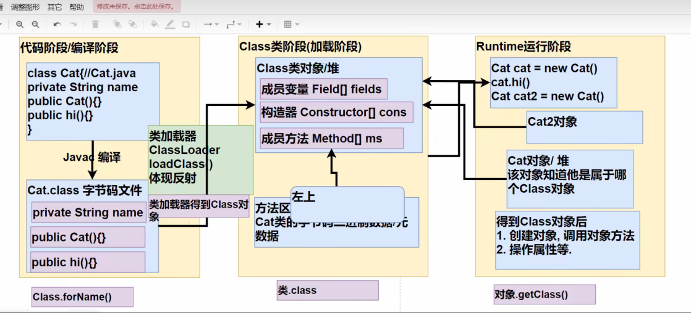
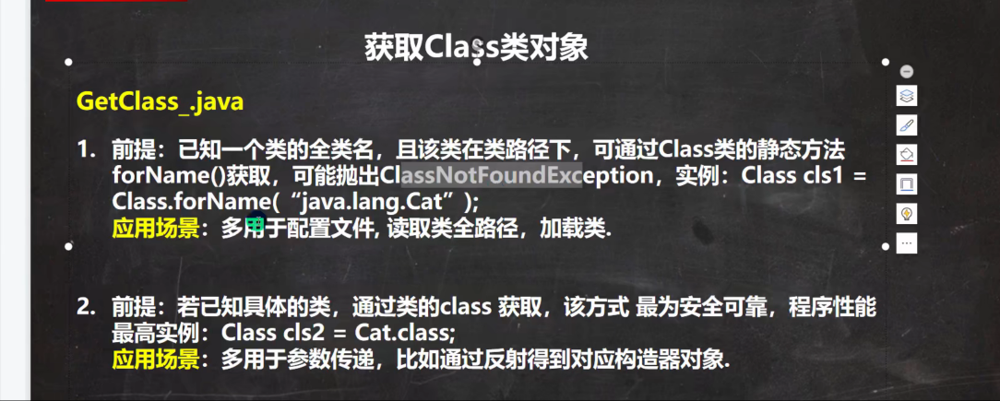
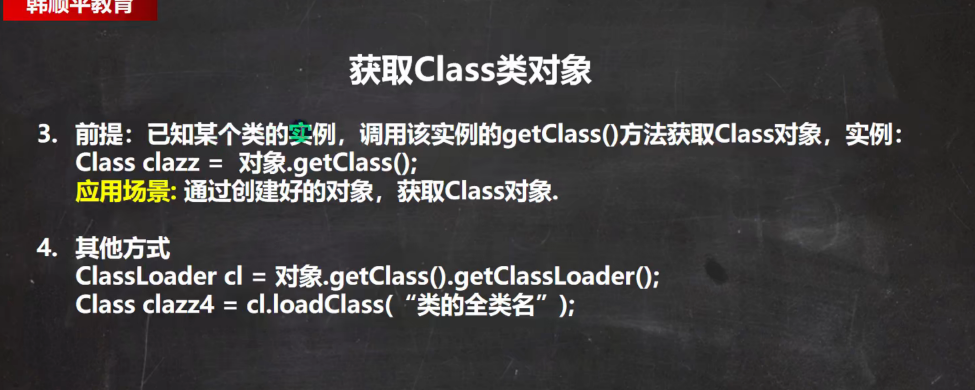
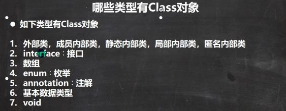
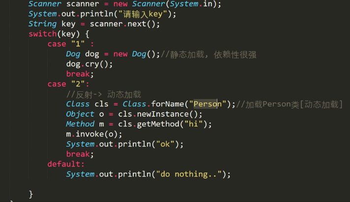
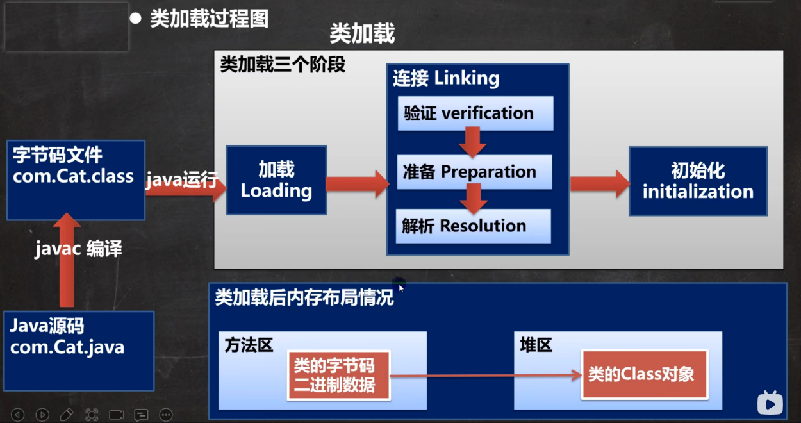
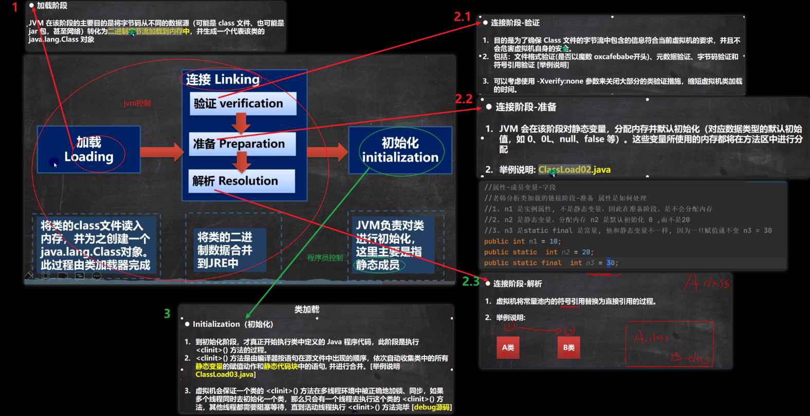

***
[TOC]

***

## reflect(反射)
### 1.反射机制

### 2.获取Class对象的四种方式

### 3.哪些类型有Class对象

### 4.静态加载和动态加载,类加载时机

### 5.类加载过程

### 6.类加载的三个阶段
* 1.加载Loading 
* 2.连接Linking 
  * 2.1验证Verification 
  * 2.2准备Preparation 
  * 2.3解析Resolution 
* 3.初始化initialization

